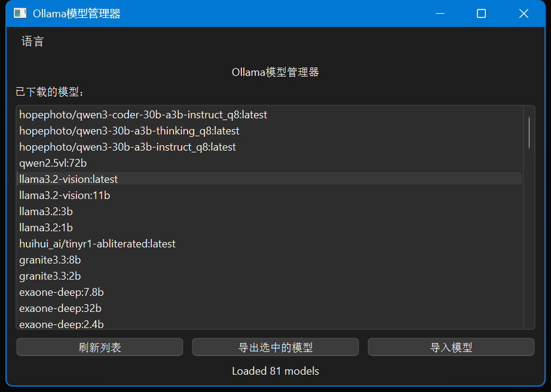
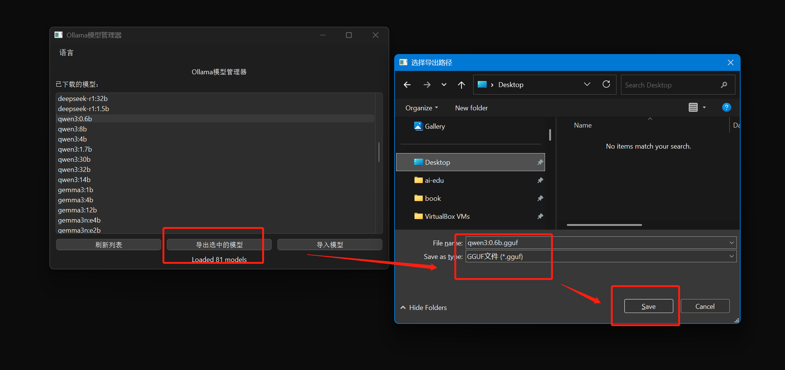
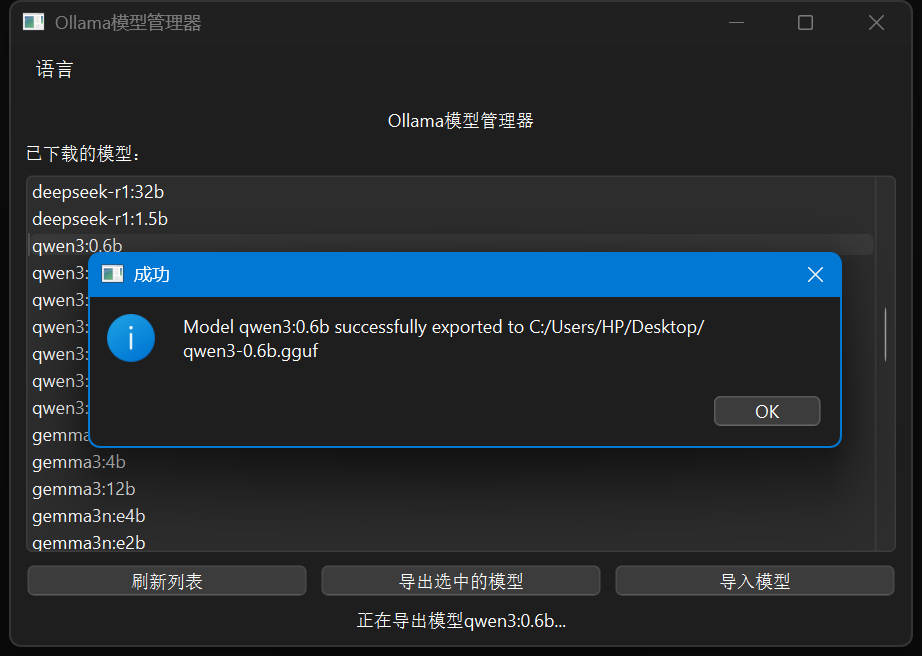
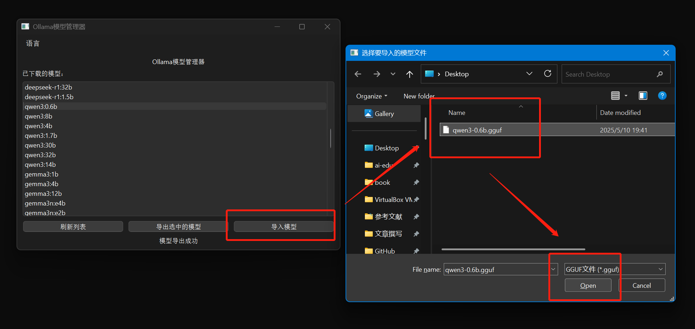

# Ollama Model Manager

## Description

Ollama Model Manager is a graphical tool designed to export Ollama models to GGUF format and import GGUF files back into Ollama models. It provides an intuitive user interface for managing your Ollama models, supporting both Windows and Linux operating systems.

## Features

- Export Ollama models to GGUF format
- Import GGUF files to Ollama models
- Graphical user interface (GUI) for easy operation
- Cross-platform support (Windows and Linux)
- Bilingual support (Chinese and English)
## System Requirements

- Python 3.11 or higher
- Ollama installed and running
- PySide6 library

## Installation

1. Clone this repository:
   ```
   git clone https://github.com/your-username/OllamaModelManager.git
   ```
2. Navigate to the project directory:
   ```
   cd OllamaModelManager
   ```
3. Install the required Python packages:
   ```
   pip install PySide6
   ```

## Usage

1. Run the application:
   ```
   python app.py
   ```
2. In the GUI:
   - Click "Refresh List" to load the list of downloaded models
   - Select a model and click "Export Selected Model" to export it to GGUF format
   - Click "Import Model" to import a GGUF file as a new Ollama model


## Screenshots

### Main Interface


### Export Model


### Export Success


### Import Model



## Notes

- On Windows, ensure your system encoding is set to UTF-8 to properly display model names. You can use `chcp 65001` to set it.
- Make sure the Ollama service is running before using this tool.
- The exported GGUF files can be used with other tools that support the GGUF format.

## License

This project is licensed under the MIT License. See the [LICENSE](LICENSE) file for details.