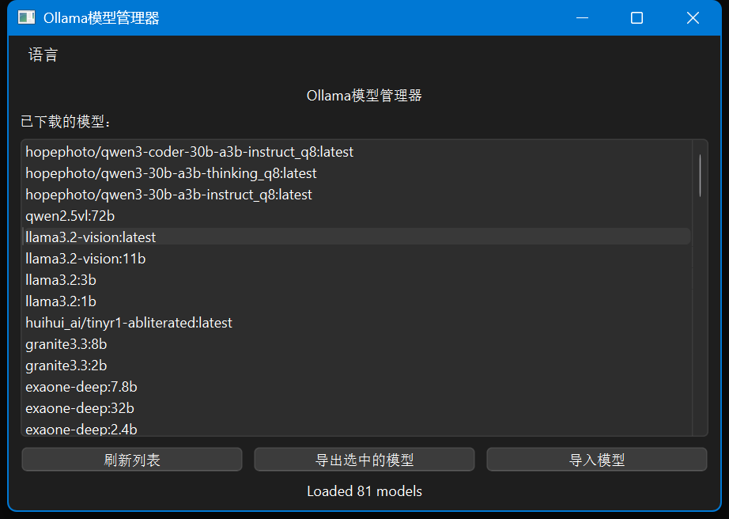
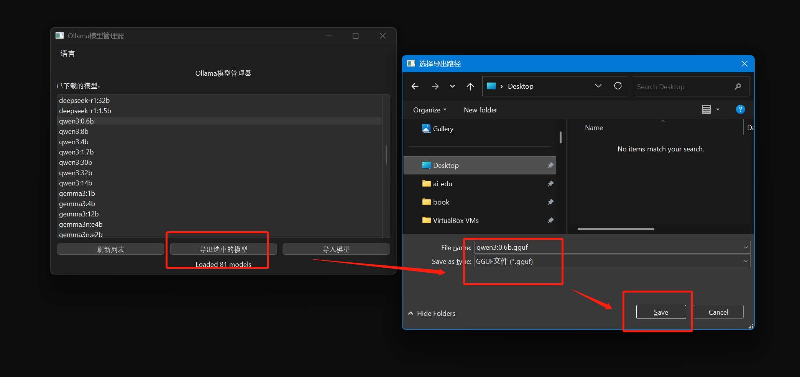
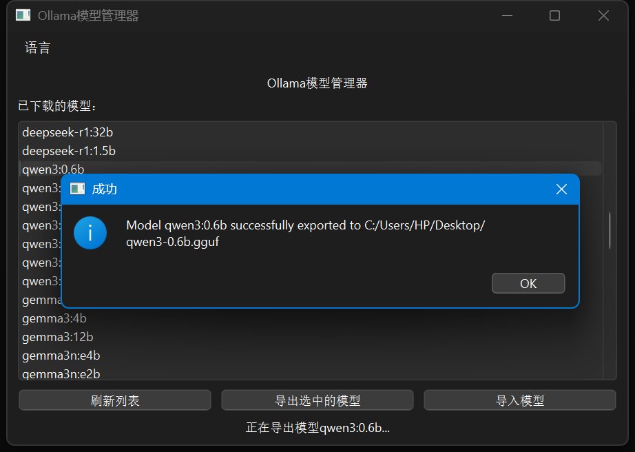
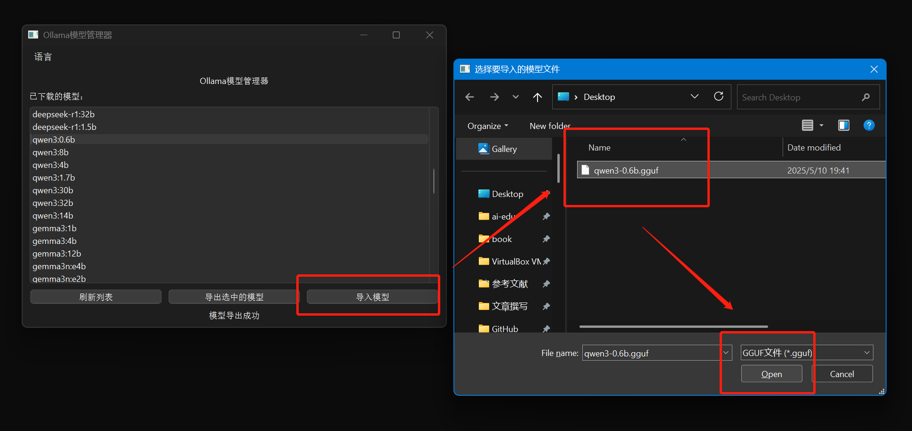

# OllamaModelManager

一个用于导出Ollama模型为GGUF格式和将GGUF文件导入Ollama模型的工具。

## 功能特性

- 导出Ollama模型为GGUF文件
- 从GGUF文件导入模型到Ollama
- 支持Windows和Linux系统
- 图形用户界面操作

## 界面截图

### 主界面


### 导出模型


### 导出成功


### 导入模型


## 系统要求

- Python 3.11+
- Ollama已安装并运行
- PySide6库

## 安装

1. 克隆此仓库：
   ```bash
   git clone https://github.com/EasyCam/OllamaModelManager.git
   ```

2. 安装依赖：
   ```bash
   pip install PySide6
   ```

## 使用方法

1. 运行应用程序：
   ```bash
   python app.py
   ```

2. 在图形界面中：
   - 点击"刷新列表"查看已下载的模型
   - 选择模型后点击"导出选中模型"将模型导出为GGUF文件
   - 点击"导入模型"从GGUF文件导入模型到Ollama

## 注意事项

- 在Windows系统上，如果遇到编码问题，可以在命令行中运行 `chcp 65001` 命令
- 确保Ollama服务正在运行
- 导出的模型文件格式为GGUF
